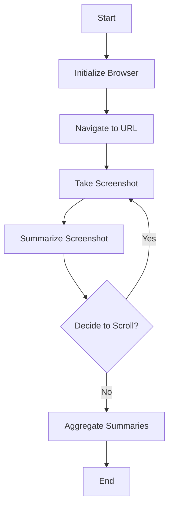

# Web Browsing Agent with LangGraph

## Description
This project implements a web browsing agent using LangGraph to automate navigation, screenshot capture, and content summarization. 
It leverages Playwright for browser automation and the Gemini for summarizing page content and making scroll decisions. 
The agent processes a webpage, captures screenshots, generates summaries, and aggregates them into a final report based on a user-defined task.

## Demo Video

https://github.com/user-attachments/assets/2b247b69-7f62-42fd-9bb6-b3c68ef4e38d

## Flowchart
Agent's workflow:



## Features
- **Automated Navigation**: Navigates to a specified URL using Playwright.
- **Screenshot Capture**: Captures screenshots of the webpage as base64-encoded strings.
- **Content Summarization**: Uses Gemini to summarize screenshot content based on a user-defined task.
- **Dynamic Scrolling**: Decides whether to scroll further based on page content (currently forced).
- **Summary Aggregation**: Combines individual screenshot summaries into a final report.
- **Error Handling**: Gracefully handles browser and LLM errors with informative logs.

## Learning Section
### LangGraph Basics
LangGraph is a framework for building stateful, graph-based workflows with LLMs. 
It allows defining nodes (tasks) and edges (transitions) to manage complex agent interactions.
In this project, LangGraph orchestrates the sequence of browser initialization, navigation, screenshot capture, summarization, and scrolling decisions.

### Why Base64 is Used
Screenshots are captured as binary data and encoded as base64 strings to be compatible with LLM inputs (e.g.,Gemini), which accept text or image URLs. 
Base64 encoding allows the screenshot to be embedded directly in the prompt as a `data:image/png;base64` URL, avoiding external file storage. 
This ensures seamless integration with the LLM for summarization tasks.
Also passing string to the LLMs leads to less token consumption than passing images as whole.

### Conditional Edge
LangGraph’s conditional edges enable dynamic routing based on state or LLM decisions. 
In this project, the `route_scroll_decision` function determines whether to loop back to the screenshot node (to capture more content) or proceed to the aggregation node. 
This is controlled by checking scroll outcomes or browser initialization status.

### Playwright Basics
Playwright is a browser automation library for controlling Chromium, Firefox, or WebKit browsers. 
It supports headless and non-headless modes, page navigation, screenshot capture, and JavaScript evaluation. 
In this project, Playwright launches a Chromium browser, navigates to a URL, captures screenshots, and scrolls the page programmatically.

## Tech Stack
- **LangGraph**: Framework for graph-based agent workflows.
- **Playwright**: Browser automation for navigation and screenshot capture.
- **Gemini 2.5 Flash**: LLM for summarization and decision-making.

## How to Use
1. **Clone the Repository**:
   ```bash
   git clone https://github.com/SwekeR-463/WebSum.git
   cd WebSum
   ```

2. **Install Dependencies**:
   ```bash
   pip install -r requirements.txt
   ```

3. **Set Up Environment Variables**:
   Create a `.env` file in the project root and add your Google Gemini API key:
   ```
   GOOGLE_API_KEY='your-api-key-here'
   ```

4. **Install Playwright Browsers**:
   ```bash
   playwright install
   ```

5. **Run the Agent**:
   Execute the main script to start the agent:
   ```bash
   python main.py
   ```
   The agent will navigate to the hardcoded URL (e.g., `https://www.akramz.space/p/on-applied-researchhtml`), capture screenshots, summarize content, and output a final aggregated summary.

6. **Customize the Task**:
   Modify the `task` field in the `initial_state` dictionary in `run_graph` to change the summarization objective (e.g., `"Summarize the key points of the blog"`).

7. **View Output**:
   Check the console for logs, including screenshot summaries and the final aggregated summary.
